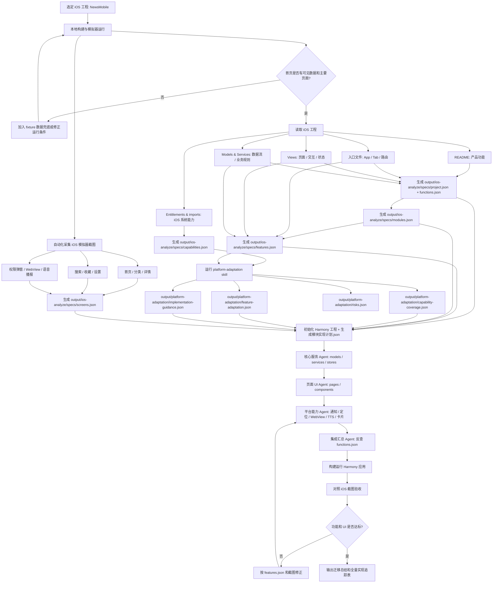
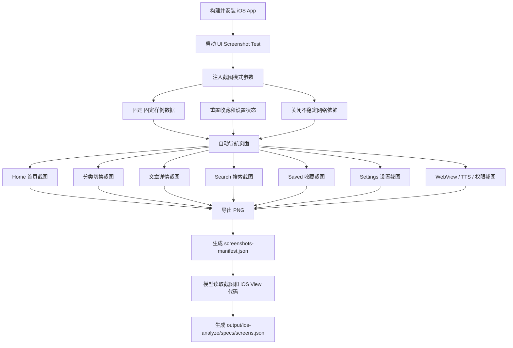

# NewsMobile iOS 到 HarmonyOS NEXT 迁移方案

## 当前目录约定

- `skills/`：放可复用执行能力，例如 `ios-analyze`、`platform-adaptation`、`harmony-generate`、`harmony-visual-verify`。
- `output/`：放中间产物和迁移结果文档，例如 iOS 分析 JSON specs、平台能力适配 JSON、全量实现追踪、迁移状态、workflow rendered prompt。
- `方案/`：放方案、诉求、多 agent 工作流、agent 设计等文档。
- `NewsMobile/`：iOS 源工程。
- `NewsMobileHarmony/`：HarmonyOS NEXT 目标工程。
- `workflow/`：保留可执行 runner、profiles、prompts、agent 身份配置和 `ios-to-harmony-workflow` 总入口说明。

## 目标

当前选定样本工程为本地目录 `NewsMobile`。迁移目标不是直接把 Swift 代码逐行改写成 ArkTS，而是先把 iOS 工程变成可执行的迁移规格，再按规格实现 HarmonyOS NEXT 应用。

核心流程：

1. 逐文件读取 iOS 工程，输出 `output/ios-analyze/specs/*.json`（工程索引、模块、功能、函数、页面、能力、资源）。
2. 自动运行 iOS 模拟器，采集关键页面截图。
3. 基于 `specs/*.json` 和参考库运行 `platform-adaptation` skill，输出 `output/platform-adaptation/*.json`（能力覆盖、feature 适配、实现指导、风险）。
4. 按模块计划、核心服务、页面 UI、平台能力、集成汇总多个子 agent 实现 HarmonyOS NEXT 版本。
5. 对照 iOS JSON specs 和截图验收。

阶段边界必须固定：

- Harmony 生成不能由一个 agent 写简单壳工程，必须拆为模块实现计划、核心服务、页面 UI、平台能力、集成汇总几个阶段。
- 真实数据接入属于核心服务阶段，UI 高保真复刻属于页面 UI 阶段，最后由集成汇总阶段反查 `output/ios-analyze/specs/functions.json`。
- Harmony 视觉验收阶段负责读取 iOS/Harmony 截图逐页对比，输出 `output/harmony-visual-verify/界面对齐.md`，差异明显时继续修 ArkUI。

## 为什么选择 NewsMobile

`NewsMobile` 是一个 SwiftUI 新闻阅读应用，规模比天气 App 更复杂，但没有大型社交、IM、多账号后台这类过重业务。

适合作为当前迁移样本的原因：

- 主流程清楚：新闻首页、推荐、搜索、收藏、设置、文章详情。
- 有真实数据来源：公开 RSS、Open-Meteo 天气接口，不需要 API Key。
- 没有 Firebase、Google 登录、账号后台等复杂配置。
- 使用 Apple 原生能力较多，适合做 iOS 到 HarmonyOS NEXT 能力映射。
- 页面和功能足够丰富，能验证 UI 复刻、数据层迁移和系统能力整改。
- 工程结构较清晰，README 已说明模块、服务和测试情况。

迁移目标为全量迁移：主 App、Widget/卡片、云同步、后台刷新、本地 API server 等能力都要进入迁移范围。可以区分平台直迁、等价替代和配套服务，但不能简单标记为不做。

## 总体流程图



## 功能清单怎么获取

功能清单不要靠模型凭感觉写，必须从工程证据抽取。

### 1. 从 README 抽产品功能

README 用来确定产品级能力：

- RSS 新闻聚合。
- 首页分类新闻。
- For You 个性化推荐。
- 搜索。
- Watch Later 收藏。
- 设置。
- 趋势话题。
- 语音播报。
- 天气组件。
- 本地通知。
- Widget。
- iCloud Sync。
- 后台刷新。

### 2. 从入口文件抽主导航

重点读取：

- `NewsMobile/NewsMobile/NewsMobileApp.swift`
- `NewsMobile/NewsMobile/ContentView.swift`

当前主导航是 5 个 Tab：

- `Home`
- `For You`
- `Search`
- `Saved`
- `Settings`

入口还暴露了启动行为：

- 启动本地 `NovaAPIServer`。
- 注册后台刷新任务。
- 请求通知权限。
- 启动后拉取新闻。
- 根据设置决定深色模式。

### 3. 从 Views 抽页面和交互

重点扫描 `NewsMobile/NewsMobile/Views/`：

- `HomeView`：天气、趋势话题、分类、新闻列表、刷新、详情弹窗。
- `ForYouView`：推荐流。
- `SearchView`：搜索新闻。
- `WatchLaterView`：收藏和稍后阅读。
- `SettingsView`：显示、通知、语音、个性化、内容过滤、同步、后台刷新、天气。
- `ArticleDetailView`：文章详情。
- `ArticleWebView`：原文网页。
- `AudioBriefingView`：语音播报。
- `KeywordAlertsView`：关键词提醒。
- `CustomFeedsView`：自定义 RSS。
- `LocalNewsView`：本地新闻位置设置。
- `StoryClusterView`：相关新闻聚类。
- `CategoryView`：分类新闻页。

建议用命令生成初始线索：

```bash
rg -n "TabView|NavigationStack|NavigationLink|sheet|toolbar|Form|List|LazyVStack|refreshable" NewsMobile/NewsMobile
```

### 4. 从 Models 和 Services 抽数据流

重点扫描：

- `Models/NewsModels.swift`
- `Services/NewsAggregator.swift`
- `Services/RSSParser.swift`
- `Services/WatchLaterManager.swift`
- `Services/SettingsManager.swift`
- `Services/NotificationManager.swift`
- `Services/TTSManager.swift`
- `Services/WeatherService.swift`
- `Services/CustomFeedManager.swift`
- `Services/LocalNewsService.swift`
- `Services/StoryClusterEngine.swift`
- `Services/TrendingTopicsEngine.swift`
- `Services/PersonalizationEngine.swift`

每个功能条目按这个模板写入 `output/ios-analyze/specs/features.json`：

```json
{
  "id": "feature.news.home_feed",
  "level1": "新闻浏览",
  "level2": "首页信息流",
  "level3": "新闻列表加载与展示",
  "name": "首页新闻流",
  "entry_points": ["ContentView", "HomeView"],
  "screens": ["screen.home.feed"],
  "modules": ["views.home", "services.news", "models.article"],
  "functions": ["services.news.fetchArticles"],
  "capabilities": ["network.urlsession"],
  "resources": ["tab.home", "color.accent"],
  "source_refs": ["MyApp/Views/HomeView.swift", "MyApp/Services/NewsService.swift"],
  "data_sources": [{"type": "network", "name": "NewsService.fetchTopStories", "fallback": "fixture"}],
  "states": ["loading", "populated", "empty", "error"],
  "user_actions": ["切换分类", "下拉刷新", "点击新闻卡片进入详情"],
  "acceptance": ["首页启动后不能空白", "有数据态展示标题、来源、时间和摘要或图片"],
  "migration_priority": "high"
}
```

## 多 Agent 工作流

整个迁移不能由一个 skill 或一个长上下文 agent 全包。当前采用“agent 身份配置 + agent runner（如 opencode run / codex exec 等工具）阶段执行 + 本地文件交接”的方式。

用户入口固定为：

```text
通过 ios-to-harmony-workflow 执行 <iOS工程目录> 的 iOS 工程转换，输出到 <Harmony工程目录>
```

用户不需要创建或管理 agent，只需要指定输入 iOS 工程目录和输出 HarmonyOS NEXT 工程目录。

workflow runner 只负责：

- 检查当前阶段。
- 检查输入输出文件。
- 渲染阶段 prompt。
- 通过 agent runner（如 opencode run / codex exec 等工具）启动阶段执行。
- 验收阶段门禁。
- 更新 `output/workflow/迁移状态.md`。

每个阶段默认不继承完整对话上下文，只读取本阶段需要的本地文件。

详细方案见：

- `多agent迁移工作流.md`
- `agent设计.md`

阶段 skill 拆成五个独立能力，每个 skill 只负责一个阶段：

```text
ios-analyze/
├── SKILL.md
├── references/
│   └── output-templates.md
└── scripts/
    ├── inspect_ios_project.py
    └── capture_ios_snapshots.py

platform-adaptation/
├── SKILL.md
└── references/
    └── platform-capabilities.json

harmony-generate/
├── SKILL.md
└── references/
    └── project-template/

harmony-visual-verify/
└── SKILL.md
```

### Skill 1：`ios-analyze`

只负责固定 iOS 原应用事实，输出机器可读 JSON specs：

1. 运行 `scripts/inspect_ios_project.py` 生成工程扫描中间索引。
2. 逐文件读取 Swift 源码，输出 `output/ios-analyze/specs/*.json`（project.json、modules.json、features.json、functions.json、screens.json、capabilities.json、resources.json）。
3. 所有 JSON 之间通过稳定 id 互相引用。
4. `features.json` 是核心产物，按三级功能结构组织，每个 feature 有稳定 id、source_refs、acceptance。
5. 辅助截图通过 XCUITest 自动采集，截图计划写入 `specs/screens.json`。
6. 人工摘要输出到 `output/ios-analyze/reports/*.md`，只从 JSON 派生。

明确约束：不能手动点击模拟器采集截图。截图必须通过 UI Test 或等价自动化流程生成。

### Skill 2：`platform-adaptation`

只负责把 iOS 平台能力转换为 HarmonyOS NEXT 侧可执行的迁移策略：

1. 读取 `output/ios-analyze/specs/*.json` 和 `skills/platform-adaptation/references/platform-capabilities.json`。
2. 命中能力集合，输出 `output/platform-adaptation/capability-coverage.json`。
3. 按 feature 生成适配策略，输出 `output/platform-adaptation/feature-adaptation.json`。
4. 生成代码生成指导，输出 `output/platform-adaptation/implementation-guidance.json`。
5. 输出风险清单 `output/platform-adaptation/risks.json`，每条风险必须有 recommended_action。
6. 策略枚举：`native_equivalent` / `api_replacement` / `product_degradation` / `custom_service` / `unsupported_pending_decision`。
7. 人工摘要输出到 `output/platform-adaptation/reports/平台能力适配摘要.md`。

### Skill 3：`harmony-generate`

只负责鸿蒙工程辅助生成：

1. 读取 `output/ios-analyze/specs/*.json`、`output/platform-adaptation/*.json` 和截图。
2. 生成或修改 HarmonyOS NEXT ArkTS/ArkUI 工程。
3. 实现数据模型、服务、页面、平台能力和 fixture 数据兜底。
4. 构建验证并输出全量实现追踪表和外部配套要求。

## 文件交接原则

阶段之间不能靠聊天上下文交接，必须靠本地文件交接。

关键交接文件：

- `output/workflow/迁移状态.md`
- `output/ios-analyze/specs/project.json`
- `output/ios-analyze/specs/modules.json`
- `output/ios-analyze/specs/features.json`
- `output/ios-analyze/specs/functions.json`
- `output/ios-analyze/specs/screens.json`
- `output/ios-analyze/specs/capabilities.json`
- `output/ios-analyze/specs/resources.json`
- `output/platform-adaptation/capability-coverage.json`
- `output/platform-adaptation/feature-adaptation.json`
- `output/platform-adaptation/implementation-guidance.json`
- `output/platform-adaptation/risks.json`
- `output/harmony-generate/harmony全量实现追踪.md`

这样后续 agent 不需要继承前面所有上下文，只需要读取明确输入文件。

## 自动化截图方案

UI 复刻不能只看代码，必须以 iOS 模拟器截图为依据。截图采集必须自动化，不能依赖人工点页面。

### 截图自动化流程



### 需要补的 iOS 测试能力

`NewsMobile` 当前只有单元测试 target，没有 UI Test target。为了稳定截图，建议补一个很薄的 `NewsMobileUITests`：

- 使用 `XCUIApplication` 启动 App。
- 传入 `-uiSnapshotMode true`。
- 点击 Tab、分类、文章卡片、设置入口。
- 每个关键状态保存截图。
- 输出截图到固定目录。

同时给关键控件补 `accessibilityIdentifier`：

```swift
tab.home
tab.forYou
tab.search
tab.saved
tab.settings
home.category.topStories
home.articleCard
settings.keywordAlerts
settings.customFeeds
settings.localNews
```

### 截图目录

建议输出：

```text
output/ios-analyze/screenshots/
  01-home.png
  02-home-category-technology.png
  03-article-detail.png
  04-article-webview.png
  05-search-empty.png
  06-search-results.png
  07-saved-empty.png
  08-saved-with-article.png
  09-settings.png
  10-keyword-alerts.png
  11-custom-feeds.png
  12-local-news.png
  13-audio-briefing.png
```

再生成：

```text
output/ios-analyze/screenshots/screenshots-manifest.json
```

manifest 记录每张截图对应的页面、入口、操作路径和期望用途。

## 迁移前文档产物

迁移前由 `ios-analyze` 和 `platform-adaptation` 两个 skill 生成核心 JSON specs 和适配策略。

### `output/ios-analyze/specs/*.json`（ios-analyze 产物）

**project.json**：工程索引，包含 targets、schemes、bundle_ids、entry_points、dependencies。

**modules.json**：iOS 原始目录/模块结构，每个模块含 id、ios_paths、responsibility、public_interfaces、depends_on、used_by、suggested_harmony_boundary。

**features.json**：三级功能清单（一级→二级→三级），每个 feature 含稳定 id、entry_points、screens、modules、functions、capabilities、resources、data_sources、states、user_actions、acceptance、migration_priority。

**functions.json**：轻量函数索引（模块→类型→函数→输入/输出/副作用/迁移动作），migration_action 枚举：model / service / store / arkui_component / platform_adapter / merge / delete_with_reason。

**screens.json**：页面清单，每个 screen 含 ios_view、feature_ids、route、states、key_controls、layout_notes、screenshot 路径。

**capabilities.json**：iOS 系统能力清单，只记录 Apple 侧事实，每项含 id、capability、source_refs、runtime_behavior、permission_or_entitlement、feature_ids。

**resources.json**：UI 资源归档，含 SF Symbols、Assets.xcassets、Tab 图标、关键颜色，通过 used_by_features 或 screen_id 关联功能或页面。

人工摘要输出到 `output/ios-analyze/reports/*.md`，从 JSON 派生，只供审阅。

### `output/platform-adaptation/*.json`（platform-adaptation 产物）

**capability-coverage.json**：当前工程命中能力集合，每项含 status（mapped/unmapped）、ios 信息、harmony 信息、affected_features/modules/functions。

**feature-adaptation.json**：每个 feature 的适配策略，含 strategy、harmony_kit、implementation_boundary、required_permissions、manifest_changes、generation_tasks、ui_constraints、fallback。

**implementation-guidance.json**：给 harmony-generate 的主要输入，按工程层级聚合任务，含 platform_modules（target_path、public_api、implementation_tasks）、manifest_requirements、permission_requirements、service_requirements、store_requirements。

**risks.json**：可执行风险清单，每条含 level、capability_id、affected_features、problem、decision_needed、recommended_action。

策略枚举：`native_equivalent` / `api_replacement` / `product_degradation` / `custom_service` / `unsupported_pending_decision`。

人工摘要输出到 `output/platform-adaptation/reports/平台能力适配摘要.md`。

## HarmonyOS NEXT 全量迁移范围

全部迁移：

- 首页新闻流。
- 分类切换。
- For You 推荐页。
- 搜索页。
- 收藏页。
- 设置页。
- 文章详情页。
- 原文 WebView。
- 语音播报。
- 本地通知入口。
- 天气卡片。
- RSS 拉取。
- 固定样例数据兜底数据。
- 本地设置和收藏持久化。

需要配套实现：

- WidgetKit 对应鸿蒙卡片能力。
- iCloud Sync 对应云同步或自建同步服务。
- BackgroundTasks 对应鸿蒙后台任务/代理提醒/刷新策略。
- Local API server 对应本地网络服务或应用内调试服务。
- Apple NaturalLanguage 对应鸿蒙侧 NLP/规则算法/端侧模型能力。
这些都属于迁移目标，工程侧必须给出入口、接口或适配层。

## Harmony 实现顺序

1. 创建 `NewsMobileHarmony` 工程。
2. 定义 ArkTS 数据模型：`NewsArticle`、`NewsSource`、`NewsCategory`、`Settings`，来源 `output/ios-analyze/specs/features.json` 和 `functions.json`。
3. 按 `output/platform-adaptation/implementation-guidance.json` 实现数据层和平台适配层。
4. 实现本地存储：设置、收藏、阅读状态。
5. 按 `output/ios-analyze/specs/screens.json` 和 iOS 截图实现主 UI：Tabs、首页、推荐、搜索、收藏、设置。
6. 实现详情和 WebView。
7. 实现 TTS 语音播报。
8. 实现通知权限和本地通知。
9. 实现天气卡片和定位授权。
10. 对照 iOS 截图调整布局、间距、字体层级和交互。
11. 按 `output/platform-adaptation/implementation-guidance.json` 的 platform_modules 实现卡片、云同步、后台刷新、本地 API、NLP 等配套能力入口和适配层。
12. 构建运行并输出迁移总结与全量实现追踪表。

## 验收标准

iOS 侧：

- `NewsMobile` 能在模拟器启动。
- 首页能看到新闻数据，或截图模式下能看到 固定样例数据。
- 自动截图能覆盖首页、分类、详情、搜索、收藏、设置、WebView、语音播报。
- 能输出 `output/ios-analyze/specs/*.json`（features.json、screens.json、capabilities.json 等）和 `output/platform-adaptation/*.json`（capability-coverage.json、implementation-guidance.json 等）。

HarmonyOS NEXT 侧：

- 应用能构建运行。
- 首屏离线也有新闻内容，不出现空白页。
- 主 Tab、列表、详情、搜索、收藏、设置可用。
- WebView、TTS、通知、定位、卡片、云同步、后台刷新、本地 API 等能力均需有可验证实现或明确外部配套要求。
- UI 能对照 iOS 截图说明复刻关系。
- 每个 Harmony 实现都能追溯到 `features.json` 中的 feature、`screens.json` 中的页面截图或 `platform-adaptation/*.json` 中的能力映射。

## 当前结论

`NewsMobile` 可以作为当前中小型 iOS 到 HarmonyOS NEXT 迁移样本。正确做法是先自动化抽取规格和截图，再实现鸿蒙工程。这样可以避免模型直接凭感觉改写，也能让评测更客观：功能是否覆盖、UI 是否接近、系统能力是否被正确迁移，都有文档和截图作为依据。
